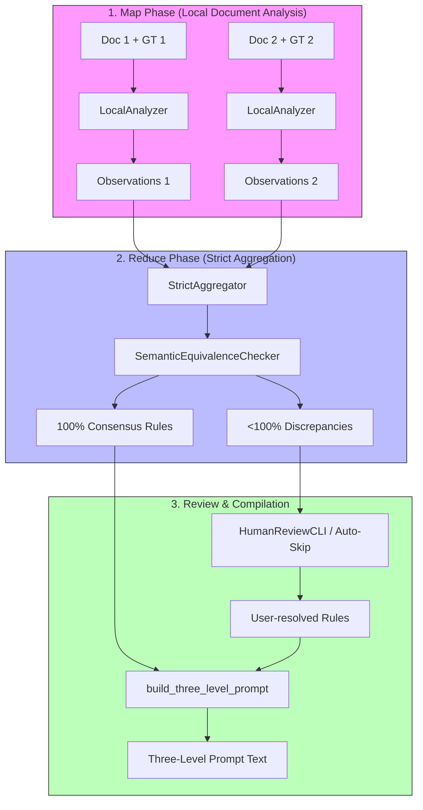

# Optimization Module Architecture & Workings

## 1. Overview & Core Features

The **Optimization** module automates extraction agent prompt and instruction tuning using DSPy's MIPROv2 Bayesian optimization. It also handles ground truth validation, dataset compilation, and MLflow experiment tracking.

In addition to Bayesian optimization, it features a **Ground Truth (GT) Contrastive Analyzer** subsystem. This subsystem compares the extraction model's predictions with ground truth data on a sample of training documents using a Map-Reduce pipeline, identifies inconsistencies and rules, resolves discrepancies interactively with a human reviewer, and compiles them into a structured three-level prompt instruction.

### Key Capabilities:
*   **Prompt Self-Optimization**: Proposing, testing, and selecting high-performing prompt instructions and few-shot examples using MIPROv2.
*   **GT Contrastive Analysis**: Automatically extracting rules and finding conflicts by comparing model outputs against GT using an LLM-in-the-loop Map-Reduce process.
*   **Human-in-the-Loop CLI**: Interactive command-line workflow for reviewing, editing, and merging extraction rule discrepancies.
*   **Three-Level Prompt Compiler**: Programmatic compilation of prompt instructions partitioned into System (`[META]`), Row/Entity (`[ENTITY]`), and Field/Schema (`[SCHEMA]`) constraints.
*   **Validation Checks**: Pre-flight data validation ensuring splits consistency and ground-truth alignments.
*   **Experiment Tracking**: Automatic logging of runs, metrics, and models to MLflow.

---

## 2. Command Line Interface & Usage

### Core Commands & Subcommands
The CLI entry point is `ae-optimize` (defined in [cli.py](../src/ae/optimization/cli.py)). It provides commands to run the optimization loop directly, run standalone contrastive analyses, or perform interactive human reviews of compiled discrepancies.

#### 1. Full Agent Optimization
```bash
ae-optimize [--config CONFIG_DIR] [--run-name RUN_NAME] [--no-mlflow] [--enable-contrastive] [--analysis-file FILE] [--analysis-batch-size N] [--auto-skip-review]
```
* **Arguments & Flags**:

| Flag / Option | Argument Type | Description |
| :--- | :--- | :--- |
| `--config` | Path | Path to configuration directory (defaults to root `config/` directory). |
| `--run-name` | str | Short name prefix for the MLflow run (timestamps are appended automatically). |
| `--no-mlflow` | flag | Disables MLflow tracking for the optimization run. |
| `--enable-contrastive` | flag | Runs the GT Contrastive Analysis pipeline before prompt optimization. |
| `--analysis-file` | Path | Path to a pre-calculated JSON result from a previous contrastive analysis, skipping Map-Reduce. |
| `--analysis-batch-size`| int | Number of training documents to use for contrastive analysis (default: `10`). |
| `--auto-skip-review` | flag | Skips the interactive human review CLI and uses only 100% consensus rules. |

#### 2. Standalone Contrastive Analysis
Extracts rules and finds conflicts by comparing predictions to Ground Truth, producing a JSON analysis report and a compiled text prompt.
```bash
ae-optimize analyze [--config CONFIG_PATH] [--batch-size N] [--output JSON_OUTPUT_PATH] [--auto-skip-review]
```
* **Options**:
  * `--config`: Path to the config file (e.g. `config/core.yaml`).
  * `--batch-size`: Number of documents to process from the training split (default: `10`).
  * `--output`: Path to save the final JSON result (default: `data/analysis/<task_name>_analysis_result.json`).
  * `--auto-skip-review`: Skip interactive review.

#### 3. Interactive Discrepancy Review
Launches the human-in-the-loop CLI console to resolve cached schema discrepancies manually.
```bash
ae-optimize review --analysis-file JSON_PATH [--auto-skip]
```
* **Options**:
  * `--analysis-file`: Path to the JSON analysis result file containing unresolved discrepancies.
  * `--auto-skip`: Automatically skip all discrepancies, utilizing only the 100% consensus rules.

---

## 3. Architecture & Key Code Components

The module is structured into the core MIPROv2 self-tuning system and the contrastive analysis package located in `src/ae/optimization/contrastive`.

### Key Code Components:

| File Link | Class / Function / Module | Role / Description |
| :--- | :--- | :--- |
| [orchestrator.py](../src/ae/optimization/orchestrator.py) | [OptimizeAgentUseCase](../src/ae/optimization/orchestrator.py#L120) | Orchestrates the end-to-end self-tuning pipeline, integrating validation, contrastive prompts, tuning loop, and MLflow logging. |
| [cli.py](../src/ae/optimization/cli.py) | [main](../src/ae/optimization/cli.py#L547) | CLI entry point supporting click subcommands (`analyze`, `review`) and standard optimization runs. |
| [dataset.py](../src/ae/optimization/dataset.py) | [DatasetBuilder](../src/ae/optimization/dataset.py#L326) | Compiles training/evaluation `dspy.Example` datasets from Markdown files and CSV ground truths. |
| [dataset.py](../src/ae/optimization/dataset.py) | [DataValidator](../src/ae/optimization/dataset.py#L51) | Performs pre-flight validations on train/val splits and document presence. |
| [tracking.py](../src/ae/optimization/tracking.py) | [ExperimentTracker](../src/ae/optimization/tracking.py#L15) | Manages parameter, metric, and artifact logging in MLflow. |
| [models.py](../src/ae/optimization/contrastive/models.py) | [AnalysisResult](../src/ae/optimization/contrastive/models.py#L95) | Pydantic data schemas representing verified rules, discrepancies, review decisions, and analysis reports. |
| [analyzer.py](../src/ae/optimization/contrastive/analyzer.py) | [LocalAnalyzer](../src/ae/optimization/contrastive/analyzer.py#L23) | Compares single document extraction to Ground Truth (Map Phase) with retry loop, per-attempt isolated signature class, and read-through write-through caching. |
| [analyzer.py](../src/ae/optimization/contrastive/analyzer.py) | [ContrastiveMapRunner](../src/ae/optimization/contrastive/analyzer.py#L162) | Batches Map-phase execution with a `Semaphore`-bounded concurrency limit. Returns results in **input order** via `asyncio.gather`. |
| [aggregator.py](../src/ae/optimization/contrastive/aggregator.py) | [StrictAggregator](../src/ae/optimization/contrastive/aggregator.py#L85) | Aggregates individual observations into verified rules or unresolved discrepancies (Reduce Phase) using semantic equivalence checks. |
| [aggregator.py](../src/ae/optimization/contrastive/aggregator.py) | [SemanticEquivalenceChecker](../src/ae/optimization/contrastive/aggregator.py#L19) | DSPy Signature for the Zero-Tolerance Consensus Judge LLM call. Receives rules as a Markdown bullet list. |
| [aggregator.py](../src/ae/optimization/contrastive/aggregator.py) | [extract_json](../src/ae/optimization/contrastive/aggregator.py#L45) | Brace-balanced JSON extractor used internally by `aggregator.py`. **No longer imported by `analyzer.py`** (see §7). |
| [review.py](../src/ae/optimization/contrastive/review.py) | [HumanReviewCLI](../src/ae/optimization/contrastive/review.py#L22) | Command-line interactive review interface for resolving discrepancies. |
| [builder.py](../src/ae/optimization/contrastive/builder.py) | [build_three_level_prompt](../src/ae/optimization/contrastive/builder.py#L14) | Formulates instructions compiling `[META]`, `[ENTITY]`, and `[SCHEMA]` rules. |
| [signature.py](../src/ae/core/tasks/signature.py) | [create_signature](../src/ae/core/tasks/signature.py#L20) | Generates dynamic signature classes. When using contrastive prompt instructions, it uses minimal schema definitions and MD5 hashing of the prompt text to avoid DSPy SQLite cache conflicts. |

---

## 4. Configuration & Parameter Mapping

Configuration settings are loaded from `config/core.yaml` and `config/optimization.yaml`:

### Core Optimization Settings
| YAML Path | Variable Mapping | Type | Description |
| :--- | :--- | :--- | :--- |
| `optimization.total_load` | `val_limit` | int | Total number of dataset examples to load (Default: `10`). |
| `optimization.train_split` | `train_limit` | int | Number of examples allocated to the training split (Default: `9`). |
| `optimization.num_candidates` | `num_candidates` | int | Candidate instructions to generate per predictor (Default: `8`). |
| `optimization.num_trials` | `num_trials` | int | Total number of Bayesian search trial steps to run (Default: `25`). |
| `optimization.max_bootstrapped_demos` | `max_bootstrapped_demos` | int | Max bootstrapped few-shot examples (Default: `0` for zero-shot). |
| `optimization.max_labeled_demos` | `max_labeled_demos` | int | Max hand-labeled examples in context (Default: `1`). |
| `optimization.metric_threshold` | `metric_threshold` | float | Target validation score (0.0 to 1.0) to trigger early stopping. |
| `optimization.max_errors` | `max_errors` | int | Maximum allowed trial failures before aborting the run (Default: `3`). |

### Contrastive Analysis Settings (`config/optimization.yaml`)
| YAML Path | Type | Description |
| :--- | :--- | :--- |
| `optimization.contrastive_analysis.enabled` | bool | Whether to enable contrastive analysis before prompt optimization (Default: `false`). |
| `optimization.contrastive_analysis.batch_size` | int | Default number of documents to analyze during the Map-Reduce phase (Default: `10`). |
| `optimization.contrastive_analysis.auto_skip_review` | bool | If set to `true`, skips the interactive Human CLI session and uses only 100% consensus rules (Default: `false`). |
| `optimization.contrastive_analysis.cache_dir` | str | Directory path where local analyses and cached results are saved (Default: `"data/analysis"`). |

---

## 5. Module Workings & Data Flow

### Standalone and Pre-Optimization Contrastive Flow



### Detailed Phases & In-Process Pipeline:

1. **Validation & Setup Phase**:
   * [DataValidator](../src/ae/optimization/dataset.py#L51) reads data splits and ground truth. It validates that splits files contain valid names (`train`, `val`), checks for duplicates and splits overlap, verifies that all split keys are registered in the ground truth CSV, and normalizes document names.
   * [DatasetBuilder](../src/ae/optimization/dataset.py#L326) processes valid document Markdown keys, loads corresponding parsed texts, and loads ground truth records to output compiled sets of `dspy.Example`.

2. **GT Contrastive Analysis Phase (Map-Reduce)**:
   * **Map Phase (`LocalAnalyzer`)**: For each document in the specified batch, the analyzer queries the Teacher LM to compare the document text with the Ground Truth data. On every attempt (including retries), a **fresh anonymous subclass** of `AnalyzeDocumentSignature` is created via `type()`, ensuring complete prompt isolation per coroutine — no shared mutable state between concurrent tasks. It generates specific observations regarding entity inclusions/exclusions and field formatting/extractions.
   * **Reduce Phase (`StrictAggregator`)**: Aggregates observations across all documents. Before each LLM call, rule formulations are serialized as a **Markdown bullet list** (`- rule text`) to improve model comprehension. The `SemanticEquivalenceChecker` backed by the Teacher LM evaluates which observation patterns represent a 100% consensus rule. The returned `is_unanimous` field is parsed via **`TypeAdapter(bool).validate_python()`** to safely coerce DSPy string outputs (`"True"`, `"False"`, etc.) to actual Python booleans, with a fail-safe fallback to `False` on parse errors.
   * **Interactive Review (`HumanReviewCLI`)**: If discrepancies are found and `auto-skip-review` is false, an interactive prompt runs in the CLI, showing the conflicting patterns, text evidence, and affected documents. The user can select `accept_a`, `accept_b`, provide a `custom_rule`, or `skip`.
   * **Compilation (`build_three_level_prompt`)**: Compiles all verified and user-resolved rules into a structured instruction with three distinct levels:
     * `[META]`: System-wide settings (e.g., direct extraction, no calculations).
     * `[ENTITY]`: Row-level criteria defining which entities should be extracted or ignored.
     * `[SCHEMA]`: Specific instructions defining validation and formatting rules per field.

3. **Dynamic Signature Injection & Tuning Loop (MIPROv2)**:
   * If contrastive analysis is enabled, `OptimizeAgentUseCase` generates a dynamic signature class mapping the 3-level prompt to the `__doc__` of the class. It overrides the default signature class, utilizing minimal schema annotations (suppressing verbose field descriptions to prevent prompt dilution).
   * Generates `num_candidates` proposed instructions and sets up Optuna Bayesian search.
   * Evaluates prompt layouts on the validation split. Evaluators calculate extraction metrics (precision, recall, F1-score) by validating predicted objects against ground truth lists.

4. **Persistence & Logging Phase**:
   * The best optimized instruction set and demonstration weights are saved to a task-specific agent JSON file.
   * Metrics, run configs, and models are registered in MLflow. If contrastive analysis is active, metrics such as the number of verified rules and discrepancies are automatically logged to the MLflow run.

---

## 6. Input/Output Data Formats

### Workspace Directory Layout:
```text
├── config/
│   ├── core.yaml            # Core system configuration
│   └── optimization.yaml    # Optimization workflow & contrastive parameters
├── data/
│   ├── ground_truth/
│   │   └── <task_name>.csv  # CSV ground truth containing target extraction outputs
│   ├── splits/
│   │   └── <task_name>.json # JSON data splits (lists of train/val documents)
│   ├── analysis/
│   │   ├── <task_name>_map_<doc_id>.json        # Per-document Map-phase cache (atomic write)
│   │   ├── <task_name>_analysis_result.json     # Serialized contrastive analysis report
│   │   └── <task_name>_analysis_result.txt      # Compiled 3-level prompt text
│   ├── agents/
│   │   └── <agent_name>.json # Serialized optimized agent output
│   └── review_cache/        # Cached human-in-the-loop decisions
└── logs/
    └── llm_history/         # History files containing raw LLM requests and responses
```

### Analysis JSON Schema (`AnalysisResult`)
The serialized analysis result is a JSON file conforming to the `AnalysisResult` Pydantic model:
```json
{
  "task_name": "nanozymes",
  "analyzed_documents": 10,
  "timestamp": "2026-06-02T14:57:31",
  "verified_rules": [
    {
      "rule_id": "rule_entity_1",
      "level": "entity",
      "field_name": null,
      "rule_text": "Extract only experiments where catalytic activity of nanozymes is explicitly measured.",
      "evidence_count": 8,
      "evidence_examples": [
        "We measured the peroxidase-like activity of Fe3O4 NPs...",
        "Activity assays were conducted using TMB as substrate..."
      ]
    }
  ],
  "discrepancies": [
    {
      "discrepancy_id": "disc_field_1",
      "level": "field",
      "field_name": "km",
      "problem_description": "Inconsistent reporting of Km unit scaling.",
      "consensus_ratio": 0.5,
      "variant_a": "Always convert Km to mM",
      "variant_b": "Keep original Km units (e.g. uM, nM) as specified in text",
      "example_documents": ["c6ra00963h", "j1234567"]
    }
  ]
}
```

---

## 7. Error Handling & Resiliency

*   **Pre-flight Failure Interception**: The `DataValidator` raises immediate exceptions on duplicate split entries, empty sets, or missing ground-truth coverage, preventing wasted API costs.
*   **Contrastive Phase Fallback**: If the contrastive analysis Map-Reduce or aggregation steps fail (e.g., due to API rate limits or model timeouts), the optimizer logs a warning and gracefully falls back to the default signature/instruction config, ensuring optimization runs can complete uninterrupted.
*   **LLM Connection Resiliency**: LLM client providers implement exponential backoff with random jitter to gracefully recover from network or API rate limits (`429 Too Many Requests`).
*   **MD5-based Signature Isolation**: Because DSPy uses internal module caching, dynamic signature classes are generated with unique names embedding the MD5 hash of their compiled prompt (e.g., `DynamicExtractionSignature_<hash>`). This prevents signature class pollution and ensures DSPy's SQLite tracking registry evaluates prompts correctly across different runs.
*   **Per-attempt Prompt Isolation (Race Condition Guard)**: Each call to `LocalAnalyzer.analyze()` — including every retry — creates a **new anonymous subclass** of `AnalyzeDocumentSignature` using `type("DynamicAnalyzeSignature", (AnalyzeDocumentSignature,), {"__doc__": instruction})`. This prevents concurrent coroutines (when `max_concurrent > 1`) from overwriting each other's prompts via the shared global class.
*   **Safe Boolean Coercion (Zero-Tolerance Consensus Guard)**: DSPy's `dspy.Predict` may return boolean output fields as strings (`"True"`, `"False"`). Because any non-empty string is truthy in Python, the raw `result.is_unanimous` field is **never used directly in a conditional**. Instead, `TypeAdapter(bool).validate_python(result.is_unanimous)` from Pydantic handles all edge cases (`"true"`, `"false"`, `"yes"`, `"no"`, `1`, `0`). If parsing fails, the system conservatively defaults to `False`, routing the observation to manual review.
*   **Self-contained JSON Parser**: `LocalAnalyzer` no longer imports `extract_json` from `aggregator.py`. When a prediction returns a raw string, a local `re.search(r'```(?:json)?\s*(.*?)\s*```', ...)` regex strips Markdown fences before `json.loads()`, eliminating the cross-module dependency and any risk of circular imports.
*   **Order-Preserving Batch Execution**: `ContrastiveMapRunner.run_batch()` delegates to `asyncio.gather(*tasks)` and returns its result directly. This guarantees the output list index always matches the input list index, regardless of which coroutine finishes first — eliminating the ordering bug caused by non-deterministic `list.append()` side effects in the previous implementation.
